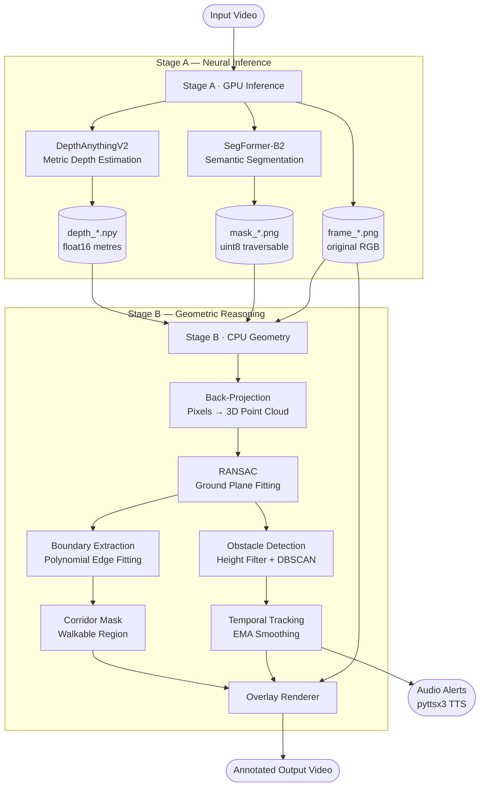

# Sidewalk Navigation Assistant for the Visually Impaired

A real-time sidewalk detection and obstacle avoidance system designed to help legally blind pedestrians navigate outdoor environments. Using a single camera, the system estimates depth, identifies the walkable corridor, detects obstacles in the path, and reports their distance and bearing — visually and optionally via spoken alerts.

---

## Background

### Depth Anything V2

[Depth Anything V2](https://depth-anything-v2.github.io/) is a state-of-the-art monocular depth estimation model that predicts a per-pixel depth map from a single RGB image. It is trained on a large-scale mixture of real and synthetic data, making it highly robust to diverse outdoor scenes including sidewalks, roads, and cluttered urban environments. The metric-outdoor variant used here outputs depth in **absolute metres**, which is critical for this project since navigation decisions (e.g., "obstacle 1.2 m ahead") require real-world units rather than relative/affine depth. A lightweight calibration constant (`metric_scale_factor`) is applied to correct for the systematic scale offset introduced by the camera's field of view and lens characteristics.

---

## System Architecture: Two-Stage Pipeline

The system is split into two independent stages, allowing the GPU-heavy neural inference to run separately (e.g., on Google Colab) while the geometric reasoning runs locally on any CPU.

```
Stage A (GPU)                               Stage B (CPU)
─────────────────────────────────────────   ─────────────────────────────────────────
Input video                                 Cached frames on disk
     │                                           │
     ▼                                           ▼
DepthAnythingV2   ──── depth_*.npy ────►   Back-projection to 3D
SegFormer-B2      ──── mask_*.npy  ────►   RANSAC Ground-Plane Fit
                  ──── frame_*.png ────►   Boundary Extraction
                                           Obstacle Detection (DBSCAN)
                                           Temporal Tracking (EMA)
                                           Overlay Rendering
                                           Output Video + Audio Alerts
```

**Stage A** runs Depth Anything V2 and SegFormer-B2 on each video frame and writes per-frame cache files to disk.  
**Stage B** reads that cache and performs all geometry, detection, tracking, and rendering without requiring a GPU.

---

## Pipeline Flowchart



---

## Project Structure

```
.
├── configs/
│   └── default.yaml              # All tunable parameters (single source of truth)
├── calibration/
│   ├── calibrate.py              # Zhang's checkerboard calibration
│   ├── extract_calibration_frames.py
│   └── intrinsics.json           # Camera matrix (fx, fy, cx, cy) + distortion
├── scripts/
│   ├── run_video.py              # Main demo entry point (Stage B)
│   ├── run_inference_colab.py    # Stage A runner (Colab/GPU)
│   └── evaluate.py               # Distance accuracy evaluation
├── src/
│   ├── config.py                 # YAML config loader
│   ├── pipeline.py               # Stage B orchestrator
│   ├── depth/
│   │   └── depth_estimator.py    # DepthAnythingV2 wrapper
│   ├── segmentation/
│   │   ├── sidewalk_seg.py       # SegFormer wrapper
│   │   └── boundary.py           # Sidewalk boundary + corridor mask
│   ├── geometry/
│   │   ├── backprojection.py     # Pinhole camera back-projection
│   │   └── ground_plane.py       # RANSAC plane fitting
│   ├── obstacles/
│   │   ├── detector.py           # Height filter + DBSCAN clustering
│   │   └── tracker.py            # EMA temporal tracking
│   └── output/
│       ├── overlay.py            # Annotated frame rendering
│       └── audio_alerts.py       # Text-to-speech alerts
└── tests/
    └── test_geometry.py          # 7 deterministic geometry unit tests
```

---

## Key Files Explained

### `src/pipeline.py` — Stage B Orchestrator

The main loop of Stage B. For each cached frame it:
1. Loads depth (`.npy`), segmentation mask (`.png`), and original frame.
2. Calls `backproject()` to produce a 3D point cloud.
3. Calls `fit_ground_plane()` to establish the ground reference.
4. Calls `extract_boundaries()` to find left/right sidewalk edges.
5. Calls `detect_obstacles()` to find objects above the ground.
6. Calls `tracker.update()` for temporal smoothing.
7. Calls `render_overlay()` and writes the output frame.

---

### `src/geometry/backprojection.py` — Pixel → 3D Back-Projection

Implements the standard **pinhole camera model** to convert each depth pixel into a 3D world point:

```
X = (u − cx) × Z / fx
Y = (v − cy) × Z / fy
Z = depth[v, u] × metric_scale_factor
```

where `(fx, fy, cx, cy)` are the camera intrinsics loaded from `calibration/intrinsics.json`. The entire computation is vectorised with NumPy — no per-pixel Python loops. A spatial stride parameter downsamples the depth map before back-projection to reduce memory usage without affecting navigation accuracy.

---

### `src/geometry/ground_plane.py` — RANSAC Ground-Plane Fitting

Fits a plane `ax + by + cz + d = 0` to the 3D ground points using **RANSAC** (Random Sample Consensus), implemented from scratch:

1. Randomly sample 3 ground points (from the traversable segmentation mask).
2. Fit a plane through those 3 points.
3. Count how many of all ground points lie within `ransac_distance_threshold` metres of the plane (**inliers**).
4. Repeat for `N` iterations, where N is derived analytically: `N = ⌈log(1−p) / log(1−(1−e)³)⌉` with `p = 0.99` confidence and `e = 0.5` outlier rate.
5. Refit the best plane via **SVD** on all inliers for maximum accuracy.

The fitted plane defines the height reference (`height = 0`) for obstacle detection. The number of RANSAC iterations is computed automatically so that with 99% probability at least one sample is outlier-free.

---

### `src/segmentation/boundary.py` — Sidewalk Boundary Extraction

Extracts the left and right edges of the walkable corridor from the segmentation mask:

1. **Row scanning**: For every image row that contains sidewalk pixels, find the leftmost and rightmost column indices.
2. **Polynomial fitting**: Fit a low-degree polynomial (degree 2) separately to the left-edge and right-edge column sequences across all rows. This produces smooth, continuous boundary curves even when individual rows are noisy.
3. **Connected-component filtering**: Uses OpenCV's `connectedComponentsWithStats` to isolate the largest contiguous sidewalk region directly under the camera, discarding adjacent roads or footpaths that may appear in the same semantic class.
4. **Width capping**: Converts the pixel-space corridor width to metres using the depth map. If the width exceeds `max_corridor_width_m`, the boundaries are clamped inward — preventing segmentation bleed onto adjacent road surfaces.
5. **Temporal smoothing**: Each boundary polynomial is smoothed across frames using an exponential moving average (EMA) with `boundary_ema_alpha = 0.2` (effective 5-frame window). Large sudden jumps (> `max_boundary_jump_px` pixels) are rejected to handle misclassification frames.

The output is a binary **corridor mask** (255 = walkable) used downstream for obstacle filtering.

---

### `src/obstacles/detector.py` — Obstacle Detection

Detects above-ground objects inside the walkable corridor:

1. **Height filter**: Computes each point's signed height above the fitted ground plane. Points with height > `height_threshold` (0.15 m) and within the corridor mask are candidate obstacle points.
2. **DBSCAN clustering**: Groups candidate points using `sklearn.cluster.DBSCAN` in metric 3D space (`eps = 0.5 m`, `min_samples = 20`). This separates spatially distinct obstacles (e.g., two pedestrians walking side by side) without requiring a pre-specified cluster count.
3. **Cluster characterisation**: For each cluster the system reports:
   - **3D centroid** in camera-relative coordinates
   - **Horizontal distance** to the nearest cluster point (not the centroid, to account for depth noise that bleeds distant pixels into near clusters)
   - **Bearing** (degrees left/right from camera centre)
   - **Bounding box** in image space

---

### `src/obstacles/tracker.py` — Temporal Tracking

Maintains identity of obstacles across frames using **greedy nearest-centroid matching**:

- Each new detection is matched to the existing track with the closest 3D centroid.
- Matched tracks apply **EMA smoothing** to both the 3D centroid and the (distance, bearing) pair, reducing jitter from frame-to-frame depth noise.
- Tracks that go unmatched for more than `max_missing_frames` consecutive frames are pruned.

This gives obstacles a stable identity across time, enabling the audio alert system to report "obstacle at 1.5 m, 10° right" without flickering.

---

### `src/output/overlay.py` — Annotated Frame Rendering

Renders the walkable corridor and obstacle information onto each frame:

- **Green shaded region**: Alpha-blended fill between the left and right boundary polynomials, showing the safe walking path.
- **Obstacle bounding boxes**: Colour-coded by proximity:
  - Green (≥ 3 m) — safe, no action needed
  - Orange (1.5–3 m) — caution, slow down
  - Red (< 2 m) — danger, stop or detour
- **Distance labels**: Each box is annotated with forward distance and lateral offset (e.g., `1.2 m | 0.3 m R`).
- **HUD**: Top-left frame counter and active obstacle count.

---

### `configs/default.yaml` — Configuration

All tunable parameters in one place:

| Parameter | Default | Purpose |
|---|---|---|
| `metric_scale_factor` | 0.3 | Corrects systematic depth over-estimation by the model |
| `ransac_distance_threshold` | 0.05 m | Inlier tolerance for ground-plane fitting |
| `height_threshold` | 0.15 m | Minimum height above ground to classify as obstacle |
| `dbscan_eps` | 0.5 m | DBSCAN neighbourhood radius |
| `min_cluster_size` | 20 | Minimum points to form a valid obstacle cluster |
| `boundary_ema_alpha` | 0.2 | EMA weight for boundary smoothing |
| `max_boundary_jump_px` | 60 | Max acceptable boundary shift per frame |
| `max_corridor_width_m` | 3.0 | Physical corridor width cap |
| `spatial_stride` | 2 | Depth/mask downsampling factor before geometry |
| `min_boundary_coverage` | 0.05 | Minimum sidewalk pixel fraction to use class-1 mask |

---

## Segmentation Classes

SegFormer-B2 is trained on Cityscapes and produces 19-class predictions. This project uses two of them:

| Class | Label | Usage |
|---|---|---|
| 0 | Road | Ground-plane RANSAC (combined with sidewalk) |
| 1 | Sidewalk | Boundary extraction (preferred when coverage ≥ 5%) |

The combined mask (road + sidewalk) gives RANSAC robust coverage of the ground, while the sidewalk-only mask gives cleaner boundary extraction. The system automatically selects the appropriate mask for each stage.

---

## Camera Calibration

The system requires camera intrinsics `(fx, fy, cx, cy)` for accurate 3D reconstruction. These are computed once using **Zhang's checkerboard method** (`calibration/calibrate.py`) and stored in `calibration/intrinsics.json`. Accurate intrinsics are critical: a 5% error in `fx` translates directly to a 5% error in all reported distances.

---

## Usage

**Run Stage B on cached frames (CPU only):**
```bash
python scripts/run_video.py \
    --cache data/cache/<clip_name> \
    --config configs/default.yaml \
    --out output/result.mp4
```

**With spoken distance alerts:**
```bash
python scripts/run_video.py \
    --cache data/cache/<clip_name> \
    --config configs/default.yaml \
    --out output/result.mp4 \
    --audio
```

**Run Stage A on Colab (GPU):**  
Open `scripts/run_inference_colab.py` in Google Colab and run all cells. This writes the depth/mask/frame cache to Google Drive.

**Run geometry unit tests:**
```bash
pytest tests/test_geometry.py -v
```

---

## Dependencies

**Stage B (local, CPU):**
```
numpy
opencv-python
scikit-learn
pyyaml
pyttsx3        # optional, for audio alerts
```

**Stage A (Colab, GPU):**
```
torch
transformers
accelerate
Pillow
```
